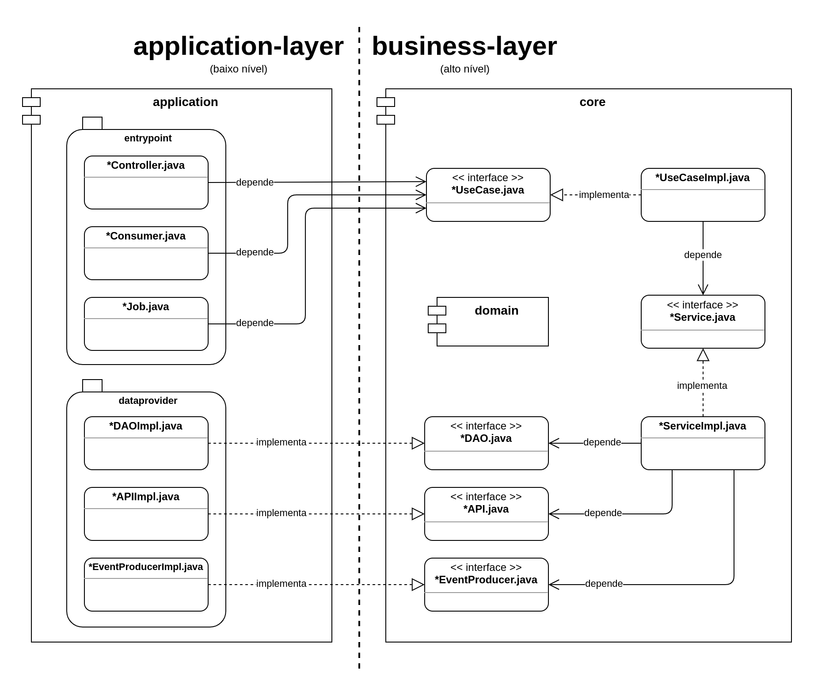

# Spring Boot Microservice Template

Este projeto implementa os _patterns_ [Microservice chassis](https://microservices.io/patterns/microservice-chassis.html) e [Service Template](https://microservices.io/patterns/service-template.html), 
utilizando como base o _framework_ [Spring Boot](https://spring.io/projects/spring-boot), provendo um padrão claro e bem definido aos times que aderirem a este _template_.

## Arquitetura

A arquitetura deste _template_ segue a literatura [The Clean Architecture](https://blog.cleancoder.com/uncle-bob/2012/08/13/the-clean-architecture.html),
implementando simplificadamente 3 camadas (application/core/domain), representadas de maneira bem definida como _subprojects_ em um projeto [Maven multiple Modules](https://maven.apache.org/guides/mini/guide-multiple-modules.html), conforme diagrama simplificado abaixo.



## Especificações e Frameworks utilizados
* Spring Boot 2.7 (Java 17)
* Logback;
* Micrometer Tracing;
* Lombok;
* MapStruct;
* JPA + Hibernate;
* H2 Database Engine;
* Rest Assured;
* ArchUnit;
* Checkstyle;
* PMD;

## Considerações

#### Testes integrados:
(Recomendado) Um _subproject_ específico ("application-layer:**integration-test**") para testes integrados foi implementado

#### Tests Unitários:
Um _subproject_ específico ("application-layer:**unit-test**") para testes unitários cobrindo os principais casos de uso desta aplicação foi implementado.
Embora os _Testes Integrados_ apresentassem maior utilidade e cobertura para este template.

#### Testes de Arquitetura:
Este _template_ utiliza a biblioteca [ArchUnit](https://www.archunit.org/) para garantir que as boas práticas e os 
princípios arquiteturais não sejam quebrados.

## Clouds disponíveis para Entrega 
* Docker Swarm (CapRover): https://portifolify-stg.servidor.gpnegociosonline.com.br/
* obs: consultar usuário e senha com recrutadora

## Como utilizar
Basta copiar este _template_ para o repositório do seu projeto, renomeando algumas referências e ajustando apropriadamente as configurações de ambiente.

#### Executando localmente:

```bash
  sudo docker-compose -f docker-compose/docker-compose.yml up
  ./mvnw clean install spring-boot:run
```